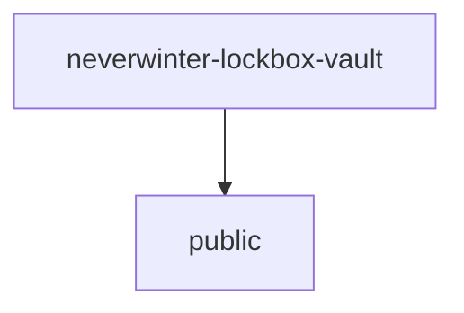
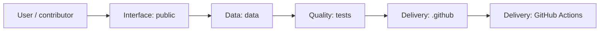
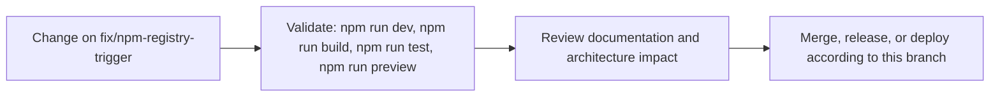

# Neverwinter Lockbox Vault

<!-- interactive-readme-standard:start -->

> [!NOTE]
> **Branch-specific documentation:** this section is maintained for [`fix/npm-registry-trigger`](https://github.com/Nischhalsubba/neverwinter-lockbox-vault/tree/fix/npm-registry-trigger). It is generated from the files present on this branch and preserves the project-authored README below.

<details open>
<summary><strong>Interactive repository guide</strong></summary>

## Branch overview

| Item | Value |
|---|---|
| Repository | [`Nischhalsubba/neverwinter-lockbox-vault`](https://github.com/Nischhalsubba/neverwinter-lockbox-vault) |
| Branch | [`fix/npm-registry-trigger`](https://github.com/Nischhalsubba/neverwinter-lockbox-vault/tree/fix/npm-registry-trigger) |
| Detected stack | Vite, JavaScript, HTML, CSS, Python |
| Detected manifests | package.json |
| Documentation policy | Every maintained branch must explain purpose, setup, structure, architecture, flows, testing, delivery, security, and ownership. |

## Repository structure

```mermaid
flowchart TD
    ROOT["neverwinter-lockbox-vault / fix/npm-registry-trigger"]
    ROOT --> P0[".github/"]
    ROOT --> P1["data/"]
    ROOT --> P2["public/"]
    ROOT --> P3["tests/"]
    ROOT --> P4[".editorconfig"]
    ROOT --> P5[".gitignore"]
    ROOT --> P6[".registry-fix-trigger"]
    ROOT --> P7["app.js"]
    ROOT --> P8["catalog.js"]
    ROOT --> P9["index.html"]
    ROOT --> P10["LOCKBOX_RESEARCH.md"]
    ROOT --> P11["media.js"]
    ROOT --> P12["package-lock.json"]
    ROOT --> P13["package.json"]
    ROOT --> P14["scripts_build.py"]
    ROOT --> P15["styles.css"]
    ROOT --> P16["vite.config.js"]
```



The diagram is generated from the branch's actual top-level files and directories. Use the branch link above for complete source navigation.

## Website or application structure



## Application and responsibility flow



## Change-to-delivery flow



## README requirements for this branch

- Explain what this branch contains and how it differs from the default branch.
- Keep installation, configuration, usage, testing, deployment, security, support, and license information accurate.
- Document repository, website or application, API, data, authentication, background-job, and deployment flows when they exist.
- Prefer Mermaid diagrams and expandable `<details>` sections for visual navigation.
- Link diagrams and modules to real source paths; never invent missing components.
- Preserve project-specific documentation and update diagrams whenever architecture or major paths change.
- Treat secrets, private infrastructure, customer data, and credentials as prohibited README content.

</details>

<!-- interactive-readme-standard:end -->

A responsive, searchable community database for Neverwinter lockboxes and their headline rewards.

The first release is intentionally framework-light. It uses semantic HTML, CSS, and JavaScript, with Vite providing the development and production build pipeline. This keeps the app fast and makes the data and image pipeline easy to evolve before introducing unnecessary architecture.

## Current scope

- 71 lockboxes from 25 April 2013 through 19 May 2026
- Search across lockbox names, companions, artifacts, mounts, races, years, and account unlocks
- Reward-type, year, and sort filters
- Grid and list views
- Accessible detail dialog and shareable URL state
- Responsive layout and reduced-motion support
- Offline/PWA support when served over HTTP
- Generated placeholder lockbox covers, with official source-discovery metadata where confirmed
- ToonForge companion, mount, and selected artifact thumbnails through explicit mappings
- Automated data-integrity tests and a production build check

## Run locally

Requirements: Node.js 22 or newer.

```bash
npm install
npm run dev
```

Vite will print the local URL, normally `http://localhost:5173`.

## Validate the project

```bash
npm run check
```

This runs the Node test suite and creates a production build in `dist/`.

## Project structure

```text
.
├── public/assets/           # App icon and lockbox artwork
├── data/
│   ├── lockboxes.json       # Canonical structured dataset
│   └── lockboxes.tsv        # Human-readable export
├── tests/                   # Dataset, media, and asset integrity checks
├── .github/workflows/ci.yml # GitHub Actions validation
├── app.js                   # Search, filters, cards, dialog, URL state
├── media.js                 # Source registry and verified ToonForge mappings
├── index.html               # Semantic application shell
├── styles.css               # Design system and responsive UI
├── sw.js                    # Offline cache
└── vite.config.js           # Production build configuration
```

## Data source

The initial dataset is based on the community spreadsheet supplied by the project owner:

https://docs.google.com/spreadsheets/d/1s66hDVSHkdwmbRmkQi4fAW_a7mh6y6TVK7hIXazs8LY/edit?gid=1802349840#gid=1802349840

The spreadsheet credits Asura of Synergy Guild as its compiler. Its README notes that cell colors indicate rarity, but it does not define the full color-to-rarity mapping. The app therefore does not infer rarity labels yet.

## Media sourcing model

The application keeps lockbox covers and reward thumbnails separate:

1. Official Neverwinter announcement pages are the preferred source for main lockbox artwork.
2. ToonForge / Neverwinter Compendium supplies companion, mount, and selected artifact thumbnails only when an explicit filename mapping exists.
3. NW Hub is tracked as a secondary research source, but an asset is not published until its direct origin can be verified.
4. Google image search is used for discovery, never as the final attribution record.
5. Missing or uncertain artwork remains a labelled placeholder rather than being guessed.

To replace a lockbox placeholder:

1. Add the verified image to `public/assets/images/`.
2. Update the matching record in `data/lockboxes.json`.
3. Set `imageStatus` to `verified-game-image`.
4. Record the original page and rights holder in the record.
5. Run `npm run check` before committing.

Example:

```json
{
  "image": "assets/images/example-lockbox.webp",
  "imageStatus": "verified-game-image",
  "imageSource": "https://www.playneverwinter.com/...",
  "imageDiscovery": {
    "provider": "Official Neverwinter",
    "pageUrl": "https://www.playneverwinter.com/...",
    "rightsHolder": "Cryptic Studios / Arc Games"
  }
}
```

Do not silently use search thumbnails or unrelated promotional artwork. Every published image should have a recorded source and a reasonable rights or attribution basis.

## Planned work

- Download and verify official lockbox artwork already discovered
- Expand ToonForge artifact mappings and cache approved reward thumbnails locally
- Automated Google Sheet import and normalization
- Dedicated lockbox detail routes for stronger search indexing
- Reward-level pages and reverse lookup
- Community corrections with source evidence
- Deployment to a public domain

## Disclaimer

This is an unofficial fan project. Neverwinter, Dungeons & Dragons, and related names and artwork belong to their respective rights holders. The project is not affiliated with Cryptic Studios, Arc Games, or Wizards of the Coast.
