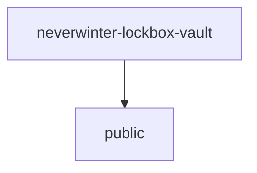
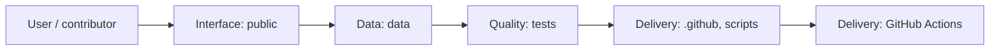
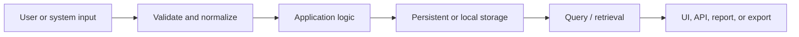
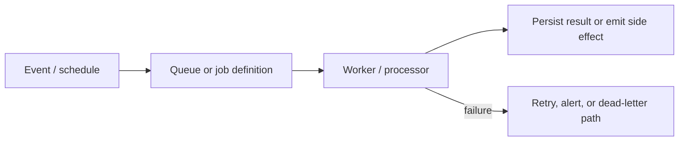
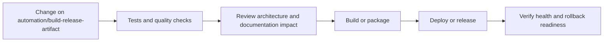
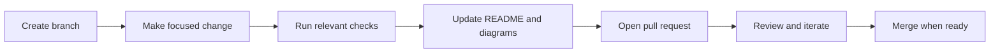

<!-- interactive-readme-standard:start -->

<div align="center">

# neverwinter-lockbox-vault

**Branch-aware technical guide for [`automation/build-release-artifact`](https://github.com/Nischhalsubba/neverwinter-lockbox-vault/tree/automation/build-release-artifact)**

<p>      </p>

<p>
  <a href="https://github.com/Nischhalsubba/neverwinter-lockbox-vault/tree/automation/build-release-artifact"><strong>Browse source</strong></a> ·
  <a href="https://github.com/Nischhalsubba/neverwinter-lockbox-vault/issues"><strong>Issues</strong></a> ·
  <a href="https://github.com/Nischhalsubba/neverwinter-lockbox-vault/codespaces/new?ref=automation%2Fbuild-release-artifact"><strong>Open in Codespaces</strong></a>
</p>

</div>

> [!IMPORTANT]
> This guide is generated from the files actually present on `automation/build-release-artifact`. It links to detected source paths, preserves project-authored notes, and avoids claiming components that were not found.

## At a glance

| Item | Detected value |
|---|---|
| Purpose | Searchable community database of Neverwinter lockboxes and their headline rewards. |
| Branch role | Compared with `main` |
| Stack | Vite, JavaScript, CSS, HTML, Python |
| Manifests | package.json |
| Prerequisites | Node.js |
| Delivery | GitHub Actions |
| License | No license file detected |

## Branch scope

This branch differs from the default branch in the following detected paths:

- [`README.md`](https://github.com/Nischhalsubba/neverwinter-lockbox-vault/blob/automation/build-release-artifact/README.md)

## Quick start

```bash
npm install
npm run dev
npm run build
npm run test
npm run preview
```

### Configuration surface

- No committed environment example file was detected.

> Never commit secrets, private keys, production credentials, customer data, or unredacted infrastructure details.

## Repository map

```mermaid
flowchart TD
    ROOT["neverwinter-lockbox-vault / automation/build-release-artifact"]
    ROOT --> P0[".github/"]
    ROOT --> P1["data/"]
    ROOT --> P2["public/"]
    ROOT --> P3["scripts/"]
    ROOT --> P4["tests/"]
    ROOT --> P5["theme/"]
    ROOT --> P6[".editorconfig"]
    ROOT --> P7[".gitignore"]
    ROOT --> P8[".npmrc"]
    ROOT --> P9["app.js"]
    ROOT --> P10["catalog.js"]
    ROOT --> P11["covers.js"]
    ROOT --> P12["index.html"]
    ROOT --> P13["LOCKBOX_RESEARCH.md"]
    ROOT --> P14["media.js"]
    ROOT --> P15["nwhub.js"]
    ROOT --> P16["package-lock.json"]
    ROOT --> P17["package.json"]
    ROOT --> MORE["+ 7 more top-level entries"]
```



| Responsibility | Detected source paths |
|---|---|
| Interface | [`public`](https://github.com/Nischhalsubba/neverwinter-lockbox-vault/tree/automation/build-release-artifact/public) |
| Data | [`data`](https://github.com/Nischhalsubba/neverwinter-lockbox-vault/tree/automation/build-release-artifact/data) |
| Quality | [`tests`](https://github.com/Nischhalsubba/neverwinter-lockbox-vault/tree/automation/build-release-artifact/tests) |
| Delivery | [`.github`](https://github.com/Nischhalsubba/neverwinter-lockbox-vault/tree/automation/build-release-artifact/.github), [`scripts`](https://github.com/Nischhalsubba/neverwinter-lockbox-vault/tree/automation/build-release-artifact/scripts) |

## Website or application map



## Architecture and responsibility flow



<details>
<summary><strong>Data flow and model surface</strong></summary>



Detected data areas: [`data`](https://github.com/Nischhalsubba/neverwinter-lockbox-vault/tree/automation/build-release-artifact/data).

</details>
<details>
<summary><strong>Background jobs and scheduled work</strong></summary>



Relevant detected files: [`worker.js`](https://github.com/Nischhalsubba/neverwinter-lockbox-vault/blob/automation/build-release-artifact/worker.js).

</details>

## Quality, security, and operations

<table>
<tr>
<td width="33%" valign="top">

### Quality

- [`tests`](https://github.com/Nischhalsubba/neverwinter-lockbox-vault/tree/automation/build-release-artifact/tests)

Detected commands:
- `npm run dev`
- `npm run build`
- `npm run test`
- `npm run preview`

</td>
<td width="33%" valign="top">

### Security

- No dedicated security policy or automated dependency configuration was detected.

Review authentication, authorization, input validation, dependency updates, secret handling, and failure recovery before release.

</td>
<td width="34%" valign="top">

### Observability

- No dedicated observability integration was detected automatically.

Define useful logs, metrics, traces, alerts, and rollback signals for production-facing branches.

</td>
</tr>
</table>

## Delivery flow



### Automation detected

- [`.github/workflows/build-release-artifact.yml`](https://github.com/Nischhalsubba/neverwinter-lockbox-vault/blob/automation/build-release-artifact/.github/workflows/build-release-artifact.yml)
- [`.github/workflows/ci.yml`](https://github.com/Nischhalsubba/neverwinter-lockbox-vault/blob/automation/build-release-artifact/.github/workflows/ci.yml)
- [`.github/workflows/extract-nwhub-assets.yml`](https://github.com/Nischhalsubba/neverwinter-lockbox-vault/blob/automation/build-release-artifact/.github/workflows/extract-nwhub-assets.yml)

## Contribution flow



- Keep changes focused and explain architectural consequences.
- Run the checks relevant to the changed area.
- Update diagrams whenever routes, modules, data models, authentication, jobs, or delivery paths change.
- Add screenshots or recordings for visual behavior changes when useful.
- Use issues for reproducible defects and pull requests for reviewable changes.

## Ownership and support

| Topic | Source |
|---|---|
| Repository | [`Nischhalsubba/neverwinter-lockbox-vault`](https://github.com/Nischhalsubba/neverwinter-lockbox-vault) |
| Branch | [`automation/build-release-artifact`](https://github.com/Nischhalsubba/neverwinter-lockbox-vault/tree/automation/build-release-artifact) |
| Ownership | No CODEOWNERS file detected |
| Contributing | Use the contribution flow above |
| Support | [Open or review issues](https://github.com/Nischhalsubba/neverwinter-lockbox-vault/issues) |
| License | No license file detected |

<details>
<summary><strong>Documentation maintenance checklist</strong></summary>

- [ ] Purpose and branch scope are accurate.
- [ ] Setup and configuration commands still work.
- [ ] Repository, application, API, data, authentication, job, and deployment diagrams match the code.
- [ ] Tests, security controls, observability, and rollback behavior are documented.
- [ ] Links point to real files on this branch.
- [ ] No secrets or private operational details are exposed.

</details>

<!-- interactive-readme-standard:end -->

<!-- project-authored-notes:start -->
<details>
<summary><strong>Project-authored notes preserved from this branch</strong></summary>

# Neverwinter Lockbox Vault

A responsive, searchable community database for Neverwinter lockboxes and their headline rewards.

The first release is intentionally framework-light. It uses semantic HTML, CSS, and JavaScript, with Vite providing the development and production build pipeline. This keeps the app fast and makes the data and image pipeline easy to evolve before introducing unnecessary architecture.

## Current scope

- 71 lockboxes from 25 April 2013 through 19 May 2026
- Search across lockbox names, companions, artifacts, mounts, races, years, and account unlocks
- Reward-type, year, and sort filters
- Grid and list views
- Accessible detail dialog and shareable URL state
- Responsive layout and reduced-motion support
- Offline/PWA support when served over HTTP
- Generated placeholder lockbox covers, with official source-discovery metadata where confirmed
- ToonForge companion, mount, and selected artifact thumbnails through explicit mappings
- Automated data-integrity tests and a production build check

## Run locally

Requirements: Node.js 22 or newer.

```bash
npm install
npm run dev
```

Vite will print the local URL, normally `http://localhost:5173`.

## Validate the project

```bash
npm run check
```

This runs the Node test suite and creates a production build in `dist/`.

## Project structure

```text
.
├── public/assets/           # App icon and lockbox artwork
├── data/
│   ├── lockboxes.json       # Canonical structured dataset
│   └── lockboxes.tsv        # Human-readable export
├── tests/                   # Dataset, media, and asset integrity checks
├── .github/workflows/ci.yml # GitHub Actions validation
├── app.js                   # Search, filters, cards, dialog, URL state
├── media.js                 # Source registry and verified ToonForge mappings
├── index.html               # Semantic application shell
├── styles.css               # Design system and responsive UI
├── sw.js                    # Offline cache
└── vite.config.js           # Production build configuration
```

## Data source

The initial dataset is based on the community spreadsheet supplied by the project owner:

https://docs.google.com/spreadsheets/d/1s66hDVSHkdwmbRmkQi4fAW_a7mh6y6TVK7hIXazs8LY/edit?gid=1802349840#gid=1802349840

The spreadsheet credits Asura of Synergy Guild as its compiler. Its README notes that cell colors indicate rarity, but it does not define the full color-to-rarity mapping. The app therefore does not infer rarity labels yet.

## Media sourcing model

The application keeps lockbox covers and reward thumbnails separate:

1. Official Neverwinter announcement pages are the preferred source for main lockbox artwork.
2. ToonForge / Neverwinter Compendium supplies companion, mount, and selected artifact thumbnails only when an explicit filename mapping exists.
3. NW Hub is tracked as a secondary research source, but an asset is not published until its direct origin can be verified.
4. Google image search is used for discovery, never as the final attribution record.
5. Missing or uncertain artwork remains a labelled placeholder rather than being guessed.

To replace a lockbox placeholder:

1. Add the verified image to `public/assets/images/`.
2. Update the matching record in `data/lockboxes.json`.
3. Set `imageStatus` to `verified-game-image`.
4. Record the original page and rights holder in the record.
5. Run `npm run check` before committing.

Example:

```json
{
  "image": "assets/images/example-lockbox.webp",
  "imageStatus": "verified-game-image",
  "imageSource": "https://www.playneverwinter.com/...",
  "imageDiscovery": {
    "provider": "Official Neverwinter",
    "pageUrl": "https://www.playneverwinter.com/...",
    "rightsHolder": "Cryptic Studios / Arc Games"
  }
}
```

Do not silently use search thumbnails or unrelated promotional artwork. Every published image should have a recorded source and a reasonable rights or attribution basis.

## Planned work

- Download and verify official lockbox artwork already discovered
- Expand ToonForge artifact mappings and cache approved reward thumbnails locally
- Automated Google Sheet import and normalization
- Dedicated lockbox detail routes for stronger search indexing
- Reward-level pages and reverse lookup
- Community corrections with source evidence
- Deployment to a public domain

## Disclaimer

This is an unofficial fan project. Neverwinter, Dungeons & Dragons, and related names and artwork belong to their respective rights holders. The project is not affiliated with Cryptic Studios, Arc Games, or Wizards of the Coast.

</details>
<!-- project-authored-notes:end -->
