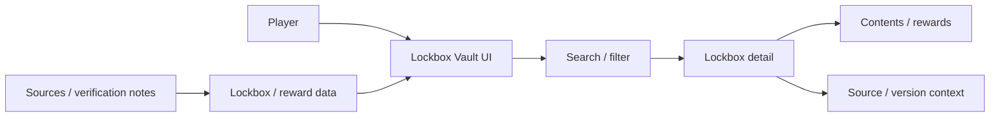
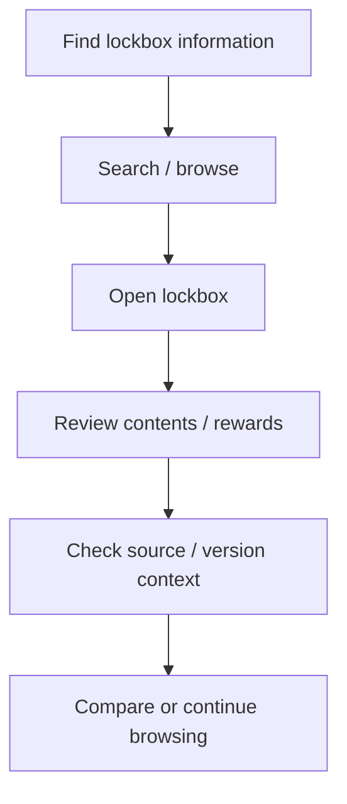
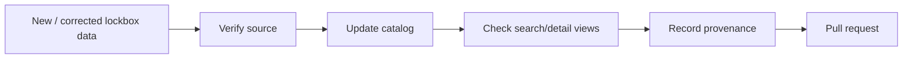

<div align="center">

# Neverwinter Lockbox Vault

**A Neverwinter lockbox reference and discovery project for organizing lockbox information, contents, rewards, and source-aware game data.**


[Browse source](https://github.com/Nischhalsubba/neverwinter-lockbox-vault/tree/main) · [Issues](https://github.com/Nischhalsubba/neverwinter-lockbox-vault/issues)

</div>

## Overview

**Neverwinter Lockbox Vault** is documented as a reference product. Players should be able to find a lockbox, inspect organized information, understand where the data came from, and distinguish verified facts from missing or version-sensitive details.

<details open>
<summary><strong>🏗️ Interactive reference architecture</strong></summary>



</details>

## Player flow



## Audience guide

| Audience | Focus |
|---|---|
| Players | Fast, understandable lockbox lookup |
| Developers | Data model, search/filtering and detail presentation |
| Designers | Dense catalog UX, comparison, empty states and mobile behavior |
| Maintainers | Provenance, verification dates and game-version changes |

## Getting started

```bash
git clone https://github.com/Nischhalsubba/neverwinter-lockbox-vault.git
cd neverwinter-lockbox-vault
```

Use the repository manifests/lockfiles to determine the current runtime and commands.

## Data quality

Do not invent reward tables, drop rates, probabilities, dates, or availability. Keep source confidence and version notes close to the data they qualify, especially when game updates may have changed a lockbox.

## SEO & discoverability

Use accurate terms such as **Neverwinter lockboxes, Neverwinter lockbox rewards, lockbox contents, Neverwinter items, lockbox guide, and Neverwinter reference** only where supported by the maintained dataset.

## Contribution flow


