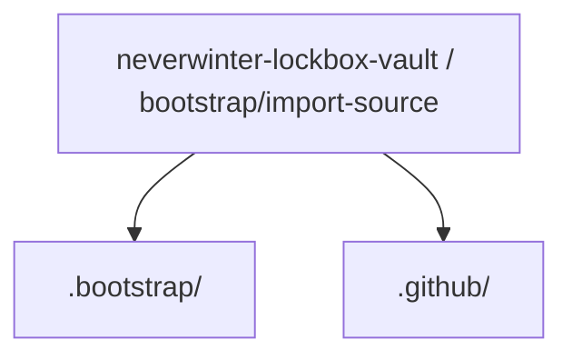
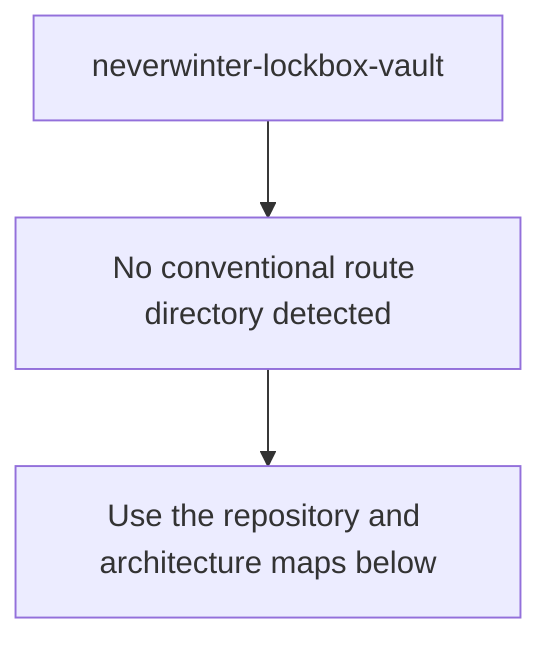
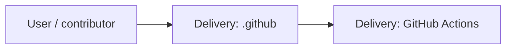
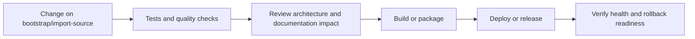
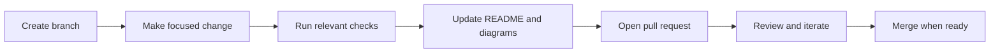

<!-- interactive-readme-standard:start -->

# neverwinter-lockbox-vault

**Branch-aware technical guide for [`bootstrap/import-source`](https://github.com/Nischhalsubba/neverwinter-lockbox-vault/tree/bootstrap/import-source)**

 

  <a href="https://github.com/Nischhalsubba/neverwinter-lockbox-vault/tree/bootstrap/import-source"><strong>Browse source</strong></a> ·
  <a href="https://github.com/Nischhalsubba/neverwinter-lockbox-vault/issues"><strong>Issues</strong></a> ·
  <a href="https://github.com/Nischhalsubba/neverwinter-lockbox-vault/codespaces/new?ref=bootstrap%2Fimport-source"><strong>Open in Codespaces</strong></a>

> [!IMPORTANT]
> This guide is generated from the files actually present on `bootstrap/import-source`. It links to detected source paths, preserves project-authored notes, and avoids claiming components that were not found.

## At a glance

| Item | Detected value |
|---|---|
| Purpose | Branch-specific project documentation generated from the repository structure without inventing missing capabilities. |
| Branch role | Compared with `main` |
| Stack | No primary framework detected automatically |
| Manifests | No standard manifest detected |
| Prerequisites | Confirm from the detected manifests |
| Delivery | GitHub Actions |
| License | No license file detected |

## Branch scope

This branch differs from the default branch in the following detected paths:

- [`.bootstrap/trigger.txt`](https://github.com/Nischhalsubba/neverwinter-lockbox-vault/blob/bootstrap/import-source/.bootstrap/trigger.txt)
- [`README.md`](https://github.com/Nischhalsubba/neverwinter-lockbox-vault/blob/bootstrap/import-source/README.md)

## Quick start

> No reliable setup command was detected. Use the preserved project-authored notes and manifests rather than guessing.

### Configuration surface

- No committed environment example file was detected.

> Never commit secrets, private keys, production credentials, customer data, or unredacted infrastructure details.

## Repository map

| Responsibility | Detected source paths |
|---|---|
| Delivery | [`.github`](https://github.com/Nischhalsubba/neverwinter-lockbox-vault/tree/bootstrap/import-source/.github) |

## Website or application map

## Architecture and responsibility flow

## Quality, security, and operations

<table>
<tr>
<td width="33%" valign="top">

### Quality

- No conventional test directory was detected automatically.

Detected commands:
- No standard quality command detected.

</td>
<td width="33%" valign="top">

### Security

- No dedicated security policy or automated dependency configuration was detected.

Review authentication, authorization, input validation, dependency updates, secret handling, and failure recovery before release.

</td>
<td width="34%" valign="top">

### Observability

- No dedicated observability integration was detected automatically.

Define useful logs, metrics, traces, alerts, and rollback signals for production-facing branches.

</td>
</tr>
</table>

## Delivery flow

### Automation detected

- [`.github/workflows/bootstrap-source.yml`](https://github.com/Nischhalsubba/neverwinter-lockbox-vault/blob/bootstrap/import-source/.github/workflows/bootstrap-source.yml)

## Contribution flow

- Keep changes focused and explain architectural consequences.
- Run the checks relevant to the changed area.
- Update diagrams whenever routes, modules, data models, authentication, jobs, or delivery paths change.
- Add screenshots or recordings for visual behavior changes when useful.
- Use issues for reproducible defects and pull requests for reviewable changes.

## Ownership and support

| Topic | Source |
|---|---|
| Repository | [`Nischhalsubba/neverwinter-lockbox-vault`](https://github.com/Nischhalsubba/neverwinter-lockbox-vault) |
| Branch | [`bootstrap/import-source`](https://github.com/Nischhalsubba/neverwinter-lockbox-vault/tree/bootstrap/import-source) |
| Ownership | No CODEOWNERS file detected |
| Contributing | Use the contribution flow above |
| Support | [Open or review issues](https://github.com/Nischhalsubba/neverwinter-lockbox-vault/issues) |
| License | No license file detected |

<strong>Documentation maintenance checklist</strong>

- [ ] Purpose and branch scope are accurate.
- [ ] Setup and configuration commands still work.
- [ ] Repository, application, API, data, authentication, job, and deployment diagrams match the code.
- [ ] Tests, security controls, observability, and rollback behavior are documented.
- [ ] Links point to real files on this branch.
- [ ] No secrets or private operational details are exposed.

<!-- interactive-readme-standard:end -->

<!-- project-authored-notes:start -->

<strong>Project-authored notes preserved from this branch</strong>

# Neverwinter Lockbox Vault

Repository initialization in progress. The validated source is being published automatically from the local project archive.

<!-- project-authored-notes:end -->
